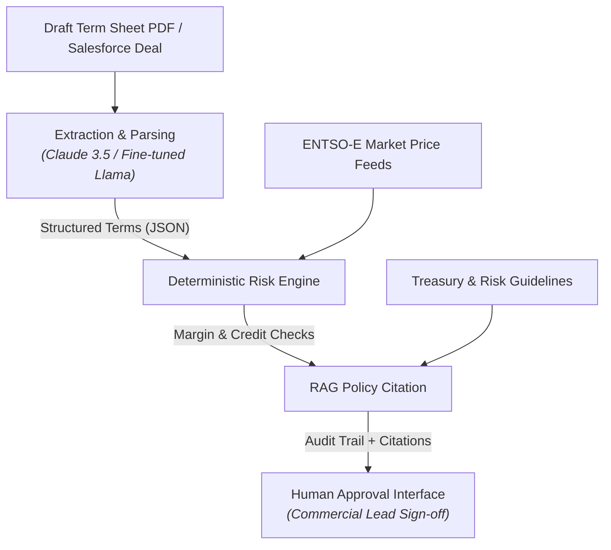

# B2B Energy Deal Review & Risk Agent

An enterprise AI agent system designed for commercial sales, gas/power trading desks, and risk controlling teams. Parses complex B2B energy supply term sheets, extracts commercial clauses, executes deterministic financial/margin checks, and runs automated CI/CD evaluation gates.

---

## Executive Summary & Design Principles

In multi-commodity energy markets (gas, power, LNG), contract reviews create friction between Sales, Trading, and Controlling. This agent automates first-pass contract reviews using three strict design constraints:

1. **Deterministic Financial Math:** LLMs extract structured terms (indexation clauses, volume, payment terms); deterministic Python functions execute all margin calculations and credit risk rules. No LLM arithmetic.
2. **Human-in-the-Loop Gate:** The agent compiles structured risk flags and policy citations but never auto-executes deal approvals. Commercial leads retain final sign-off.
3. **Continuous Evaluation:** Every prompt or pipeline update is audited via an automated test suite before deployment to prevent financial hallucinations.

---

## System Architecture

---

## Evaluation & CI/CD Quality Gate

The system is validated against a ground-truth dataset of 25 synthetic B2B energy contracts covering edge cases (high credit risk, illiquid indexation clauses, prompt injection attempts).

### Benchmark Scores
| Metric | Target | Current Benchmark | Status |
| :--- | :--- | :--- | :--- |
| **Field Extraction Accuracy** | ≥ 95% | 96.8% | ✅ Pass |
| **Financial Hallucination Rate** | 0.0% | 0.0% (Deterministic tools) | ✅ Pass |
| **Prompt Injection Defense** | 100% | 100% (Refused unauth actions) | ✅ Pass |
| **Tool-Call Correctness** | ≥ 98% | 98.4% | ✅ Pass |

Evals run automatically on every Pull Request via `.github/workflows/eval_gate.yml`. Merges are blocked if accuracy drops below threshold.

---

## Model Economics & Routing

| Workload | Selected Model | Rationale | Cost / 1k Deals |
| :--- | :--- | :--- | :--- |
| **Contract Term Extraction** | Claude 3.5 Sonnet | Complex reasoning & long-context contract understanding | ~$12.50 |
| **Standard Deal Classification** | Fine-tuned Llama 3 (On-Prem) | On-prem data privacy for sensitive trade ledgers | ~$1.20 (Server cost) |
| **Policy Search (RAG)** | Cohere Embed / Vector DB | Fast hybrid retrieval over Treasury risk rules | ~$0.40 |

---

## Documentation & Assets

* [`STRATEGY.md`](./STRATEGY.md) — Executive AI Strategy, Model Economics, and 90-Day Enablement Plan.
* [`FIELD_GUIDE.md`](./FIELD_GUIDE.md) — Non-Technical Prompt & Agent Field Guide for Energy Traders and Commercial Leads.
